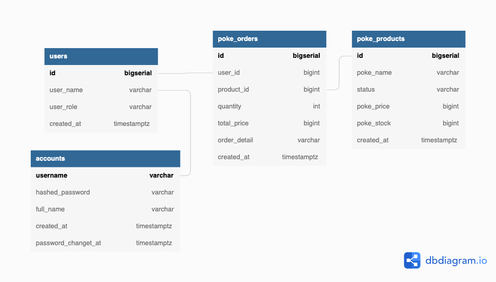

# Sample of PoS API in GO
## Pokemon Blackmart
A concept Point of Sales backend service api that provides transactional use case of pokemon (similar to product stock management). Reference to pokemon black team with LEAD and GRUNT roles.

- User stories
    - User Role : LEAD
        - Able to list the pokemon transaction data
    - User Role : GRUNT
        - Able to do CRUD data based on their user account id
        - Able to add new transaction of pokemon
        - Able to cancel some transaction based on ID
    - User use case : no auth
        - Able to create user data and access based on chosen role
        - Able to find pokemon data (currently base experience) based on poke-api by their corresponding pokemon name


## Techstack Used
1. Golang - run on 1.16
2. Postgre - run on latest version docker image
3. Docker
4. Gomock - run on latest version
5. SQLC - run on latest version
6. Golang - Migrate

## Database Schema



## Service Config
[Note] : change every need on environtment within app.env
- Run with make 
  1. Run postgres container : ```make postgres```
  2. Create postgresdb : ```make createdb```
  3. Migrate database : ```make migrateup```
  4. If you wish to run unit test the repo : ```make test```
  5. Run the server and serve the api : ```make server```
  6. Test with postman
   
## Some service API 
Attached postman collection JSON on `./asset/` directory
- account section : create account and login
  - localhost:8080/account
- user section : crud
  - localhost:8080/user
- pokemon section : crud pokemon data
  - localhost:8080/pokemon
- order section : create, cancel, and list transaction
  - localhost:8000/order